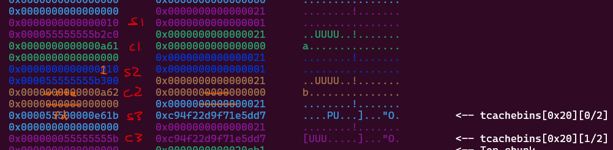
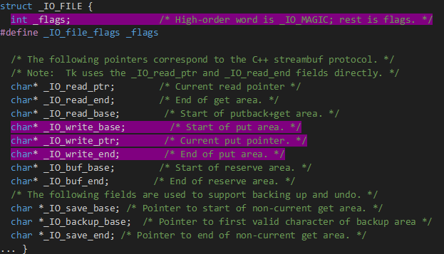

pwn/baby\_heap

> Warm up!
>
> nc 13.125.233.58 7331
>
> Files: Dockerfile, babyheap.xinetd, docker-compose.yml, share/chall

Note: Screenshots will not have consistant ASLR and PIE addresses. I
don’t want to take them all in one run of the bniary.

**Overview**

We are given 2 files of importance, the dockerfile and the challenge
binary. The libc and linker can be retrieved from building the docker
and copying the files over from /lib/x86\_64-linux-gnu/, and then the
binary can be patched with these libraries using pwninit. After
inspection of the binary, it appears to be a CRUD operation heap
challenge. The CRUD operations work as following:

1.  add: the create option, checks if the function has been called over
    16 times (16 allocations), and if not takes a chunk size (&lt;200)
    and chunk data (len &lt;= chunk size) from stdin. What was
    surprising and confusing at first was that the way the chunks are
    tracked – with another chunk of size 0x18 that had the following
    structure:

These chunk structures are stored in an array in .bss.

1.  free: the delete option, takes a chunk index from stdin, checks if
    it is &lt;= the highest chunk index but not &gt;= 0 and is not a
    null pointer, goes to the pointer, which should be a chunk
    structure, and checks that the in use and the chunk ptr of the chunk
    structure is != 0. It finally frees the chunk and the chunk
    structure in order.

2.  modify: the update option, takes a chunk index from stdin, has the
    same checks as free, and then reads 0x28 bytes from stdin to the
    chunk structures chunk ptr value.

3.  view, the read option, takes an index from stdin, has essentially
    the same checks as free and modify, then writes a chunk size amount
    of bytes from chunk ptr.

The vulnerabilities of this challenge lie in modify’s fixed read size,
the implementation of the chunk structure, and the out-of-bounds read
to array indexes &lt; 0.

**Safe-linking and Heap Leak**

For modify, heap chunk sizes can be under 0x28 (to 0x10), and this
allows for the chunk size of the next chunk to be overwritten, and
since view uses this value to determine how many bytes to read, if a
chunk after the chunk being viewed is freed, the safe linking and heap
can be leaked.

**Tcache Poisoning**

This modify OOB also allows for the fd pointer of the freed chunk
structure to be overwritten, allowing for arbitrary chunk allocation.

**Libc Leak**

Because view can read negative array indexes and because the chunk
array is in .bss, the read option can leak a libc address using the
file descriptors in .bss.

These file descriptors pass the checks for view.

So, calling view with index -5 will print 0xfbad208b bytes of data (or
till newline) from the stdin pointer, resulting in a libc leak.

**Easy arbitrary chunk allocation**

With tcache poisoning and the safe linking and heap leak from earlier,
the tcache metadata can be controlled by simply allocating a chunk in
the metadata and updating it as needed. It is worth noting that the
tcache needs to think there are chunks in the respective sized bins,
which can be done by allocating a chunk of that size, freeing it, then
finally overwriting the tcache. In this challenge, the tcache pointers
were stored at the start of heap + 0x90.

As we can see, the tcache bins are filled with these cyclic
“pointers”.

**Stack Leak**

A stack address can be leaked using the tcache control and the libc
leak. I found this information from a writeup of the challenge
“heapify” from angstromCTF 2024, which just happened recently.

From angstromCTF Discord: <https://discord.gg/Dduuscw>

It took me a little bit to figure out what he meant, but after a bit
of research this is what I found.

The \_IO\_2\_1\_stdout\_ structure is the \_IO\_FILE structure for the
stdout file descriptor. Each file descriptor uses an \_IO\_FILE
structure for its IO operations. The structure has an int for flags,
then several pointers for IO operations. That is all that matters for
this challenge, as far as I am concerned. Furthermore, the read
pointers do not matter for stdin, and buffering is disabled by the
binary, so the buffer pointers do not matter either. That means the
only values that do matter are the flags, \_IO\_write\_base,
\_IO\_write\_ptr, and \_IO\_write\_end values.

<https://sites.uclouvain.be/SystInfo/usr/include/libio.h.html>

Now, from the writeup above, the author said to set flags to
0xfbad1800. Looking into this, it turns out that the 0xfbad portion of
flags is simply a magic number, defined by \_IO\_MAGIC. The 0x1800
portion, on the other hand, is the \_IO\_IS\_APPENDING and
\_IO\_CURRENTLY\_PUTTING flags (0x1000 and 0x0800 respectively -&gt;
0x1000|0x800=0x1800), which tells the file descriptor it has data to
write, and needs to write it.

The three write pointers I am still confused about, but what worked for
me was setting \_IO\_write\_base to the start of the area, then
\_IO\_write\_end and \_IO\_write\_ptr to the end of the area I want to
leak. The pointer I wanted to leak was the environ pointer in libc,
which contains a stack address.

Using this method, the stack address should be printed in stdout. We
can get the offset from the stack leak to a return address, and ROP to
system(“/bin/sh”).

**ROP**

Now that we have a return address, a chunk can be allocated at the
return address, and the system function and all the gadgets we need
will be in libc. So, after overwriting tcache once again to the return
address (-8 because of chunk alignment), we can allocate a chunk with
our ROP payload, and a shell should be popped, and we can print the
flag.

codegate2024{423e58a4ce63d0e1fb35c9d77932f10d03898d5a56934f8b11b3833c84a6207de9aeb0ace3ac3ef9df9b30662df340eb64e60a0d2f494fb22414414999023f}

**Concepts Tried**

For this challenge, I tried a few things that didn’t work, and I just
wanted to document them.

-   **House of Tangerine**

Before I realized the read operation could go negative and that the
file descriptors could leak libc pointers, I tried to use the house of
tangerine to free the wilderness chunk to do… something (I don’t know
anymore), but this didn’t work because even if the wilderness chunk
size is overwritten so the bytes after the first two are zeroed, there
are not enough chunks, even with max size, to be able to implement the
house.

-   **Libc GOT Overwrite**

I tried to find a libc GOT pointer to overwrite to a one gadget, but
none of these pointers had the registers set up correctly for me to be
able to call a one gadget, at least not to my knowledge.

-   **Arbitrary Chunk at \_\_libc\_stack\_end**

I tried to allocate a chunk at \_\_libc\_stack\_end, which is also a
stack address, but is not writable, unlike environ. Even though this
is pretty insignificant, I wanted to include this because I think I
could have leaked stack with this method with environ instead of
\_\_libc\_stack\_end, instead of going on that file structure
adventure. Oops.
