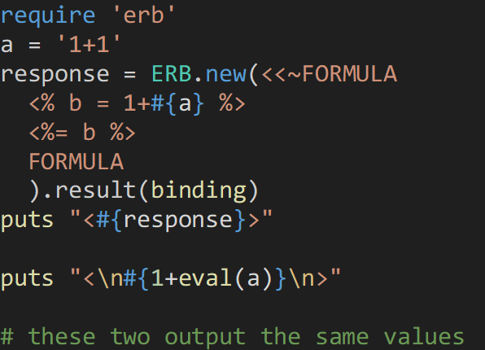
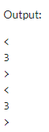
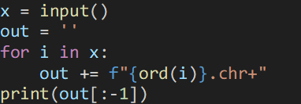
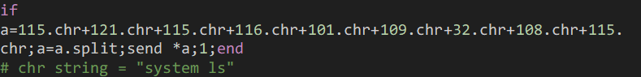
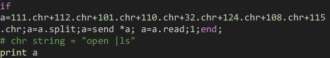
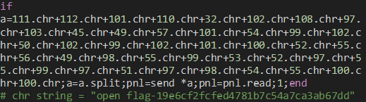

web/master\_of\_calculator

> traditional calculator challenge
>
> <http://3.34.253.4:3000/>
>
> Files: docker-compose.yml, server/\*

We are given a folder that contains the files for what appears to be a
Ruby on Rails website. Upon inspection of the dockerfile, the flag
appears to have random bytes appended to the end of the filename,
following the flag-.\* regex, meaning we will need to find the filename
as well before printing the flag. When visiting, the website allows us
to input leverage, entry price, exit price, and quantity (quentity?),
then returns 3 variables ROI, PnL, and Margin. It took me quite a bit of
time, but eventually I found the file that handled these calculations,
server/app/controllers/home\_controller.rb. I had never worked with Ruby
before, but ChatGPT would be able to analyze the code for me and find
the vulnerabilty, which lied in the program using user input for a
format string, similar to python’s exec function.

So, the challenge seems to be similar to the misc/ai\_warmup challenge –
basically a jail of some sorts with some blacklist, but this challenge
only returned the output of a variable that used the 4 inputs and did
not provide an interactive console. This time ChatGPT could not produce
a solution that worked, so I was on my own.

I used an online Ruby
compiler to figure out what I could do - <https://onecompiler.com/ruby>.
I started by figuring out how the user input led to code execution, and
I found that the implementation of the ERB class takes user inputs as
format strings, which the ERB stores as a string, and then evaluates.

So, using this, we can
execute our own code to somehow leak the filename and print the flag.
Functions in Ruby do not require parentheses, so my first idea was to
just use the open function with a string constructed with numbers and
the chr function (this was before I read the Dockerfile, so I thought
the flag would be stored in flag.txt). I used this python code to
generate the string.

And this was somewhat similar to my first attempt:

I used a different file on the online compiler, and returned a File
object for the file I tried to open.

Now my next hurdle was trying to call the read function on this file. I
found that variable declaration in Ruby returns a value, and therefore
can be used inside eval.

So, the payload looks something like this.

This should theoretically read the flag, but as mentioned earlier, the
flag matched the flag-.\* regex. After some research, I found that that
there is another function which evaluates strings into functions – send.
It can call functions with the send(function, arg, arg, …) syntax. So, I
changed my payload to this to call system(“ls”) using split to split the
function into an array, since commas are blocked.

Two issues arose from this
implementation. The website does not print stdout, so calling
system(“ls”) is useless. I found a resolution for this quickly though,
as open(“|ls”).read will return the system(“ls”) stdout.

The second issue was the program only returns response, which was a
combination of PnL, ROI, and Margin. This can be fixed by as setting one
of the variables used for response to the desired output, and it will
include the output in response. After fixing this issue, we have our
final two payloads, where the second payload’s string is retrieved from
the output of the first payload.

codegate2024{sup3r\_dup3r\_ruby\_trick\_m4st3r}

Looking back, since open was not a blocked word, the challenge could
have been solved with this much shorter payload.

